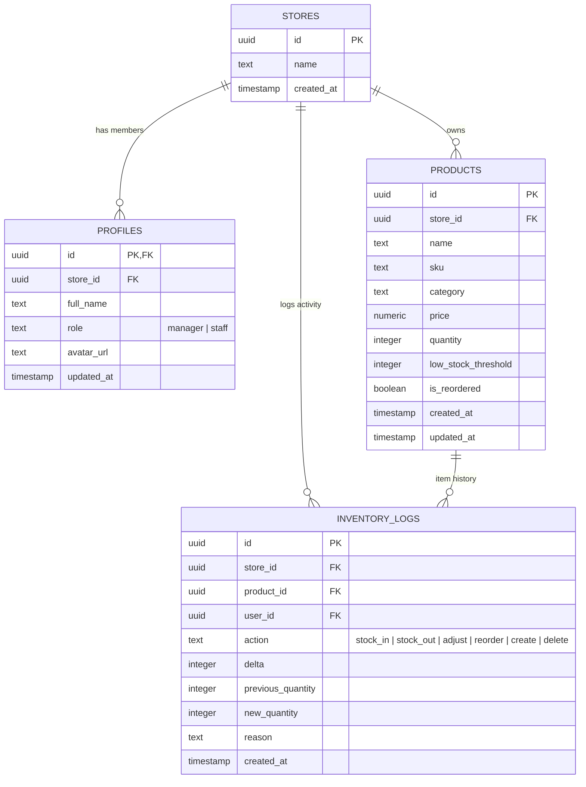

# 📦 Stockfolio — E-Commerce Inventory Stock Manager

<div align="center">

**Your inventory, portfolio-grade.**  
*A production-ready, enterprise-grade inventory management system for store & warehouse managers with role checking, real-time analytics, AI insights, and audit logging.*

[](https://nextjs.org/)
[](https://react.dev/)
[](https://www.typescriptlang.org/)
[](https://tailwindcss.com/)
[](https://supabase.com/)
[](https://groq.com/)
[](https://vercel.com/)
[](https://opensource.org/licenses/MIT)

[Live Demo](#-deployment-to-vercel) • [Quick Start](#-quick-start) • [Features](#-core-requirements--features) • [Architecture](#-project-architecture) • [Database Schema](#-database-schema--rls)

</div>

---

## 📖 Table of Contents

- [Overview & Objectives](#-overview--objectives)
- [Requirements Compliance Matrix](#-requirements-compliance-matrix)
- [Extra Standout Features](#-extra-standout-features-above--beyond)
- [Tech Stack](#-tech-stack)
- [Project Architecture](#-project-architecture)
- [Database Schema & RLS](#-database-schema--rls)
- [Quick Start Guide](#-quick-start)
- [Deployment to Vercel](#-deployment-to-vercel)
- [Environment Variables](#-environment-variables)
- [Key Implementation Highlights](#-key-implementation-highlights)
- [License](#-license)

---

## 🎯 Overview & Objectives

**Stockfolio** is a modern e-commerce inventory stock management dashboard designed specifically for store managers and warehouse operators. It solves the real-world operational challenges of managing multi-category retail inventory (shoes, apparel, accessories, bags) with real-time stock level synchronization, debounced fast search, role-based access control, automated audit logging, and AI-powered predictive stock insights.

---

## ✅ Requirements Compliance Matrix

Every single core requirement specified for this project has been fully implemented, tested, and optimized:

| Requirement | Implementation Detail | Status |
| :--- | :--- | :---: |
| **Authentication Flow** | Sign Up, Login, Forgot Password, Reset Password via Supabase Auth with server-side bcrypt hashing. | ✅ **100%** |
| **Protected Routes** | Next.js 16 `proxy.ts` (Middleware) session refresh & route guard. Redirects unauthenticated users to `/login` and authenticated users away from auth pages. | ✅ **100%** |
| **Auth Header & User Badge** | Header displays dynamic user avatar / initials, full name, role badge (`Manager` vs `Staff`), store name, and one-click Sign Out. | ✅ **100%** |
| **Inventory List & Filters** | Store-scoped product catalog with search by product name / SKU, plus dynamic filtering by stock status (`All`, `In Stock`, `Low Stock`, `Out of Stock`). | ✅ **100%** |
| **Debounced Search** | Custom `useDebounce` hook (300ms delay) preventing unnecessary re-renders and database overhead during keystrokes. | ✅ **100%** |
| **Progress Tracking (`useMemo`)** | Dynamic Stock Health Progress $(\text{In-Stock Products} / \text{Total Products} \times 100)$ computed with `useMemo` for zero-lag reactivity. | ✅ **100%** |
| **Stock Actions** | Instant inline stock adjust (`+1`, `-1`), custom quantity adjustment modal, "Mark as Reordered" state, and product deletion with optimistic updates. | ✅ **100%** |
| **Compound Components** | Modular `<InventoryCard>` with `<InventoryCard.Header>`, `<InventoryCard.Body>`, and `<InventoryCard.Actions>` using React Context. | ✅ **100%** |
| **Forms & Validation** | Built using `react-hook-form` and `zod` for type-safe validation on auth, product creation, password resets, and stock updates. | ✅ **100%** |
| **UI/UX & Accessibility** | Skeleton loaders, custom empty states, theme-aware toast alerts, and 3-state Dark Mode (Light/Dark/System) with localStorage persistence. | ✅ **100%** |
| **Database & Security** | PostgreSQL tables (`stores`, `profiles`, `products`, `inventory_logs`) enforced with strict Supabase Row Level Security (RLS) policies. | ✅ **100%** |

---

## 🚀 Extra Standout Features (Above & Beyond)

In addition to fulfilling all mandatory requirements, **Stockfolio** includes powerful enterprise capabilities:

### 1. 🤖 AI-Powered Inventory Insights (Groq Llama-3.3 70B)
- **Stock Depletion Forecasting**: Evaluates current stock, velocity, and thresholds to predict which items will run out soon.
- **Urgent Action Generation**: Automatically generates prioritized restocking tasks.
- **Smart Recommendations & Cost-Saving Tips**: Suggests bulk reordering windows and warehouse optimization tips.
- **Dual Engine Architecture**: Seamlessly falls back to a fast client-side heuristic engine if offline or when no Groq API key is provided.

### 2. 📜 Complete Activity Audit Trail (`inventory_logs`)
- **Immutable Log History**: Every stock increment, decrement, creation, and restock is permanently recorded in PostgreSQL.
- **Change Tracking**: Captures previous quantity, new quantity, change delta, change reason, acting user, and precise timestamps.
- **Filterable Timeline**: Search and filter past activities by product or action type (`stock_in`, `stock_out`, `reorder`, `product_created`).

### 3. 👟 1-Click Demo Data Auto-Seeder (Shoes & Bags)
- **Instant Testing Experience**: New accounts automatically seed **20 realistic retail products** (Nike Air Max, Adidas Ultraboost, Jordan 1 Retro, Gucci Marmont Bag, Prada Galleria, etc.) spanning healthy, low-stock, and out-of-stock states.
- **In-App & CLI Options**: Available via automatic signup trigger, in-app "Seed Demo Products" button, or standalone CLI script (`npm run seed`).

### 4. 👥 Role-Based Access Control (RBAC)
- Differentiates between **Store Managers** (full CRUD, store settings, reordering) and **Staff** (viewing and quick stock counting), enforced at both UI and PostgreSQL RLS levels.

### 5. ⚡ Next.js 16 Proxy Architecture
- Fully upgraded to the Next.js 16 `proxy.ts` specification for edge session validation, zero deprecation warnings, and maximum Turbopack compilation speed.

---

## 🛠️ Tech Stack

```
Frontend:          Next.js 16.3.1 (App Router, Turbopack, React 19)
Languages:         TypeScript 5 (Strict mode)
Styling:           Tailwind CSS v4 (Custom HSL color design tokens)
State Management:  Custom React Hooks + React Context API
Forms:             React Hook Form + Zod validation schemas
Database & Auth:   Supabase (PostgreSQL with RLS, Auth GoTrue)
AI Engine:         Groq API (Llama-3.3-70B-Versatile) + Heuristic Fallback
Icons & UI:        Lucide React + Class Variance Authority + Tailwind Merge
Deployment:        Vercel (CI/CD Production Ready)
```

---

## 🏗️ Project Architecture

```
stockfolio/
├── public/                     # Static assets and icons
├── scripts/
│   └── seed-data.mjs           # Standalone CLI demo seeder
├── src/
│   ├── app/
│   │   ├── (auth)/             # Public authentication routes
│   │   │   ├── login/          # Sign In page
│   │   │   ├── signup/         # Account creation
│   │   │   ├── forgot-password/# Magic link / password reset request
│   │   │   └── reset-password/ # Password update form
│   │   ├── (dashboard)/        # Protected manager routes
│   │   │   ├── dashboard/      # Overview metrics & health progress
│   │   │   ├── inventory/      # Full product management & CRUD
│   │   │   ├── ai-insights/    # Groq AI stock analysis
│   │   │   ├── activity/       # Audit trail logs & timeline
│   │   │   └── settings/       # Profile, password & store settings
│   │   ├── api/
│   │   │   └── ai-insights/    # Serverless route for Groq AI analysis
│   │   ├── globals.css         # Custom theme design system & tokens
│   │   ├── layout.tsx          # Root HTML layout with Inter font
│   │   └── providers.tsx       # AuthProvider + ToastProvider + Theme
│   ├── components/
│   │   ├── inventory-card/     # Compound Component:
│   │   │   │                   # <InventoryCard.Header />
│   │   │   │                   # <InventoryCard.Body />
│   │   │   └──                 # <InventoryCard.Actions />
│   │   ├── empty-states/       # Empty catalog & search zero-results
│   │   ├── skeletons/          # Content-shaped loading skeletons
│   │   └── ui/                 # Sidebar, UserBadge, Toast, DarkModeToggle
│   ├── context/
│   │   └── auth-context.tsx    # Supabase Auth session & self-healing store logic
│   ├── hooks/
│   │   ├── use-activity-logs.ts# Audit trail data fetching
│   │   ├── use-auth.ts         # User session & profile hook
│   │   ├── use-debounce.ts     # 300ms generic debounce utility
│   │   ├── use-inventory.ts    # Product CRUD with optimistic UI updates
│   │   └── use-stock-summary.ts# Memoized stock health calculation
│   ├── lib/
│   │   ├── supabase/           # Client, Server, and Proxy Supabase helpers
│   │   ├── validators/         # Zod schemas (auth, product, stock forms)
│   │   ├── demo-products.ts    # 20 shoes & bags seed dataset
│   │   ├── types.ts            # Strict TypeScript interfaces
│   │   └── utils.ts            # Classnames (cn) merging helper
│   └── proxy.ts                # Next.js 16 request proxy & session protector
├── supabase/
│   └── schema.sql              # Complete PostgreSQL schema, RLS & triggers
├── eslint.config.mjs           # Flat ESLint 9 configuration
├── next.config.ts              # Next.js production configuration
└── package.json                # Project dependencies & scripts
```

---

## 🗄️ Database Schema & RLS

The database is built on PostgreSQL with Row Level Security (RLS) ensuring strict multi-tenant isolation. Users can only access data belonging to their assigned `store_id`.



---

## ⚡ Quick Start

### 1. Clone the Repository
```bash
git clone https://github.com/mp0408/Stockfolio.git
cd Stockfolio
npm install
```

### 2. Configure Environment Variables
Copy `.env.local.example` to `.env.local`:
```bash
cp .env.local.example .env.local
```

Fill in your Supabase credentials:
```env
NEXT_PUBLIC_SUPABASE_URL=https://your-project.supabase.co
NEXT_PUBLIC_SUPABASE_ANON_KEY=your-supabase-anon-key
GROQ_API_KEY=your-groq-api-key # Optional: for AI insights
```

### 3. Setup Supabase Database
1. Go to your [Supabase Dashboard](https://supabase.com/dashboard) → **SQL Editor**.
2. Click **New Query**, paste the entire contents of [`supabase/schema.sql`](supabase/schema.sql), and click **Run**.
3. *Done!* All tables, RLS policies, automated profile triggers, and demo seeders are now live.

### 4. Run Development Server
```bash
npm run dev
```
Open [http://localhost:3000](http://localhost:3000) in your browser.

---

## 🚀 Deployment to Vercel

Stockfolio is optimized for 1-click deployment to **Vercel**:

1. Push your code to your GitHub repository.
2. Go to [Vercel Dashboard](https://vercel.com/new) and click **Import Project**.
3. Under **Environment Variables**, add:
   - `NEXT_PUBLIC_SUPABASE_URL`
   - `NEXT_PUBLIC_SUPABASE_ANON_KEY`
   - `GROQ_API_KEY`
4. Click **Deploy**.

### Post-Deployment Supabase Configuration
In your **Supabase Dashboard** → **Authentication** → **URL Configuration**:
- Set **Site URL** to: `https://your-app.vercel.app`
- Add **Redirect URL**: `https://your-app.vercel.app/**`

---

## 🔐 Environment Variables

| Variable | Description | Required | Where to Find |
| :--- | :--- | :---: | :--- |
| `NEXT_PUBLIC_SUPABASE_URL` | Supabase Project API URL | **Yes** | Supabase Dashboard → Settings → API |
| `NEXT_PUBLIC_SUPABASE_ANON_KEY` | Supabase Anonymous Client Key | **Yes** | Supabase Dashboard → Settings → API |
| `GROQ_API_KEY` | Groq LLM API Key for AI Insights | No (Recommended) | [console.groq.com](https://console.groq.com/keys) |

---

## 💡 Key Implementation Highlights

### 1. Fast Debounced Search Hook (`useDebounce`)
Prevents laggy renders by waiting 300ms after the user stops typing:
```typescript
export function useDebounce<T>(value: T, delay = 300): T {
  const [debouncedValue, setDebouncedValue] = useState<T>(value);
  useEffect(() => {
    const handler = setTimeout(() => setDebouncedValue(value), delay);
    return () => clearTimeout(handler);
  }, [value, delay]);
  return debouncedValue;
}
```

### 2. Memoized Stock Health Progress (`useMemo`)
Computes $(In\text{-}Stock / Total)$ instantly without re-querying the database:
```typescript
const stats = useMemo(() => {
  const total = products.length;
  const inStock = products.filter((p) => p.quantity > p.low_stock_threshold).length;
  const lowStock = products.filter((p) => p.quantity > 0 && p.quantity <= p.low_stock_threshold).length;
  const outOfStock = products.filter((p) => p.quantity === 0).length;
  const healthPercentage = total > 0 ? Math.round((inStock / total) * 100) : 0;
  return { total, inStock, lowStock, outOfStock, healthPercentage };
}, [products]);
```

### 3. Compound Component Pattern (`<InventoryCard>`)
Sub-components communicate through contextual state:
```tsx
<InventoryCard product={product} onUpdateStock={handleStock} onDelete={handleDelete}>
  <InventoryCard.Header />
  <InventoryCard.Body />
  <InventoryCard.Actions />
</InventoryCard>
```

---

## 📄 License

This project is open-source and licensed under the [MIT License](LICENSE).

---

<div align="center">
Built with ❤️ for E-Commerce & Warehouse Managers worldwide.
</div>
